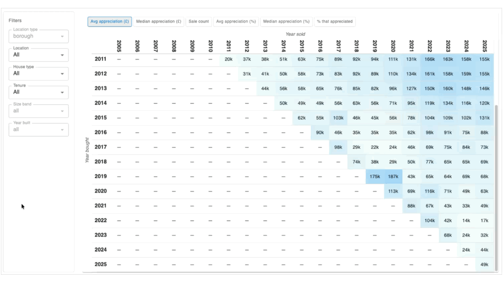

# Calor

Interactive analytics for UK house price performance, built on [Land Registry Price Paid Data](https://www.gov.uk/government/statistical-data-sets/price-paid-data-downloads). Explore how property values have changed over time with a heatmap of average appreciation between any year bought and year sold, filterable by borough, house type, tenure, size band, and year built.



## Prerequisites

- [Docker](https://docs.docker.com/get-docker/) (for DynamoDB Local)
- [Node.js](https://nodejs.org/) (for the frontend)
- [uv](https://github.com/astral-sh/uv) (Python package manager, used by the backend)
- Python 3.9+

## Quick Start (one command)

From the repo root:

```bash
./scripts/serve.sh
```

This will:

1. Start DynamoDB Local in Docker on port 8001
2. Create tables and seed sample data
3. Start the backend API at **http://localhost:8000**
4. Start the frontend dev server at **http://localhost:5173**

Press `Ctrl+C` to stop everything.

## Manual Setup

### Backend

```bash
cd backend
python3 -m venv .venv
source .venv/bin/activate
pip install -e ".[dev]"
```

Or with `uv`:

```bash
cd backend
uv sync
```

### Frontend

```bash
cd frontend
npm install
```

## Running Locally (step by step)

### 1. Start DynamoDB Local

```bash
cd backend
docker-compose up -d
```

This starts DynamoDB Local on **http://localhost:8000** (port 8000). Data persists in a Docker volume.

Alternatively, run it standalone on port 8001 (this is what `serve.sh` does):

```bash
docker run --rm -d -p 8001:8000 --name houses-dynamo-local amazon/dynamodb-local:2.3.0
```

### 2. Create tables and seed data

From the repo root:

```bash
HOUSES_DYNAMODB_ENDPOINT_URL=http://localhost:8001 python scripts/init_local.py
```

Or if DynamoDB is on port 8000 (docker-compose):

```bash
cd backend
HOUSES_DYNAMODB_ENDPOINT_URL=http://localhost:8000 uv run python ../scripts/init_local.py
```

### 3. Start the backend

```bash
cd backend
HOUSES_DYNAMODB_ENDPOINT_URL=http://localhost:8001 uv run uvicorn app.main:app --reload
```

The API will be available at **http://localhost:8000**. Adjust `HOUSES_DYNAMODB_ENDPOINT_URL` to match whichever port DynamoDB Local is running on.

### 4. Start the frontend

```bash
cd frontend
npm run dev
```

The Vite dev server starts at **http://localhost:5173** and proxies `/api` requests to the backend at `http://localhost:8000`.

To point the frontend at a different backend (e.g. a deployed Lambda), set `VITE_API_URL` in `frontend/.env`:

```
VITE_API_URL=http://localhost:8000
```

## Tests

### Backend

Start DynamoDB Local, then:

```bash
cd backend
pytest tests/ -v
```

Unit tests only (no DynamoDB required):

```bash
pytest tests/unit -v
```

### ETL

See `etl/` for Spark ETL tests and scripts.

## Project Structure

```
houses/
├── backend/          # FastAPI API + DynamoDB repository
├── frontend/         # React (Vite) UI
├── etl/              # Spark ETL: Land Registry CSV → DynamoDB
└── scripts/
    ├── serve.sh      # One-command local dev (DynamoDB + backend + frontend)
    └── init_local.py # Create tables and seed data in DynamoDB Local
```

See [backend/README.md](backend/README.md) for deployment instructions (AWS Lambda, DynamoDB, API Gateway).
